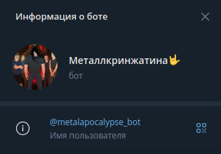
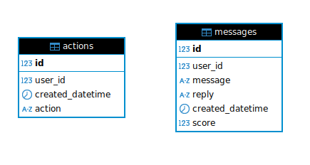

# Домашняя работа по инжинирингу данных.



Телеграм бот. 
Отвечает через LLM модель "yandexgpt-lite", в немного специфической манере.
Данные кладутся сразу в БД postgres.




## Как запускать:
1. Создать виртуальное окружение
2. Виртуально окружиться `source venv/bin/activate`
3. Установить зависимости:
```bash
pip3 install -r requirements.txt
```
4. Создать .env файл и заполнить его как в .env.example

5. Запустить:
```bash
python3 bot_regular.py
```

5.1 Можно запустить фоново, чтобы не отсвечивал:
```bash
nohup python3 bot_regular.py &
```

Дашбоард и данные можно посмотреть тут: https://datalens.yandex/1ahslok5dd9un?state=9954fbbf213

Работает на VPS Айхор Хостинг. Не реклама 😅

--- дополнение:

А сюда раз в 6 часов по крону будет складываться бэкап таблицы messages: https://disk.yandex.com/d/7VFs8EfUCHnvwA
```bash
0 */6 * * * cd /var/www/HWDE && /usr/bin/python3 backup.py >> /var/www/HWDE/backup.log 2>&1
```